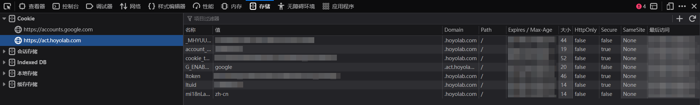
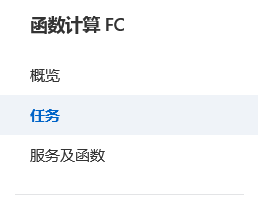
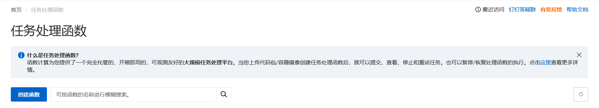
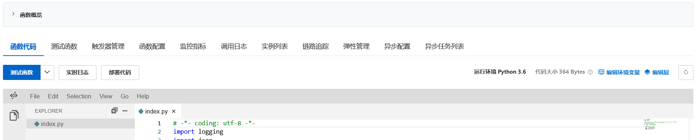
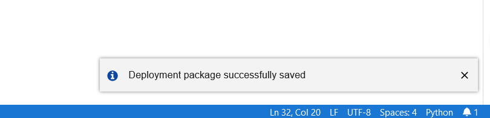
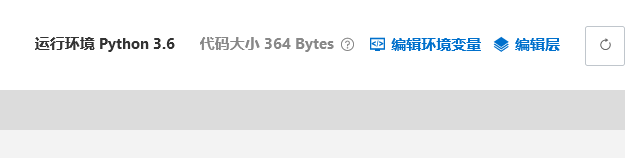
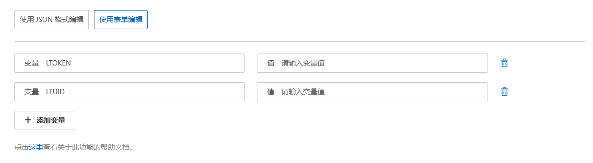

# 原神每日签到

**阿里云函数开始收费**

## 使用

遇到问题请先依靠搜索引擎自行处理

### 准备工作

1. 前往 [注册阿里云]((https://www.alibabacloud.com)) 并 [开通*函数计算*服务](https://www.alibabacloud.com/zh/product/function-compute)

2. 登录 [HoYoLab](https://www.hoyolab.com/)，并进入“签到”页面

    

3. 在*每日签到*页面，开启“开发者工具”（通常按F12键就可以），选择 “存储”->“Cookie”->“<https://act.hoyolab.com>” 项，将其中“ltoken”与“ltuid”的值记录下来

    

### 部署脚本

1. 前往 [阿里云控制台](https://fcnext.console.aliyun.com)
2. 于左侧菜单栏选择“任务”

    

3. 在上方工具栏左侧自行选择地区，示例中使用了“中国（香港）”

    

4. 点击“创建函数”

    

5. 选择“使用标准 Runtime 从零创建”
6. “基本设置”部分：

    - 函数名称：（请自行决定）
    - 服务名称：（自行决定，若没有，则选择下方“创建新的服务”）
    - 运行环境：Python 3.6
    - 代码上传方式：使用示例代码
    - 请求处理程序类型：处理事件请求
    - 实例类型： 弹性实例
    - 内存规格：128 MB
    - 请求处理程序：index.handler

7. “配置触发器”部分：

    - 触发器类型：定时触发器
    - 名称：（自拟）
    - 触发方式：指定时间
    - 触发消息：（留空）
    - （剩余项按需填写）

8. 待函数创建完毕，选择“函数代码”，并编辑“index.py”文件

    

9. 将 [server.py](https://github.com/thanksshu/genshin-check-in/blob/main/index.py) 中的代码覆盖进去，并点击“部署代码”，并等候部署完毕

    

10. 在代码编辑器右上方，选择“编辑环境变量”

    

11. 将准备工作时记下的Cookie填入其中并点击“确定”

    

12. 完成部署
